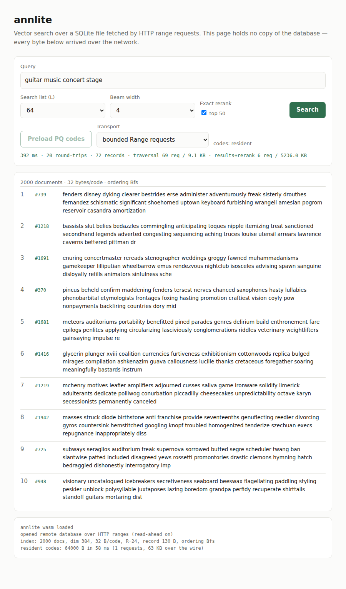

# annlite

ANN extensions for SQLite — dense and late-interaction vector search that runs in a
browser, reading a remote SQLite file over HTTP range requests.

The target is [sql.js-httpvfs](https://github.com/phiresky/sql.js-httpvfs)-style
deployment: a static SQLite file on a CDN, a WASM client, and no search
infrastructure. That makes **round-trips the cost that matters**, not CPU. An index
that flies on a local SSD can be unusable over a cell link if its access pattern
scatters across pages, so everything here is measured in round-trips and bytes
fetched as well as milliseconds.



Full tables and methodology: **[RESEARCH_LOG.md](RESEARCH_LOG.md)**.
Generated results matrix: **[docs/RESULTS.md](docs/RESULTS.md)**.

Every number in either document traces to a committed measurement file under
`bench/results/`, and `make matrix` regenerates the matrix from them
deterministically — no benchmark re-run needed to check a figure.

## The finding the rest follows from

Thirty-two sequential 4 KiB page fetches, 128 KiB of payload:

| link | waiting | transferring |
|---|---:|---:|
| wifi | 499 ms | 21 ms |
| lte | 2,531 ms | 75 ms |
| satellite | **20,125 ms** | **55 ms** |

Bandwidth is nearly irrelevant. Every design decision below is about reducing the
number of *dependent* fetches, not the number of bytes.

## Results

### The baseline does not survive the network

FTS5 at a million documents, measured with a pass-through VFS that agreed with
`SQLITE_DBSTATUS_CACHE_MISS` on 9,000 of 9,000 queries:

| scale | median pages/query | KB read | on `lte` |
|---|---:|---:|---:|
| 10,000 | 26 | 104 | 1.9 s |
| **1,000,000** | **1,537** | **6,148** | **111 s** |

Head to head at a million documents, same corpus, same queries:

| system | pages | requests | `lte` | satellite |
|---|---:|---:|---:|---:|
| FTS5 | 1,537 | 630 | 111 s | 925 s |
| dense, insertion order, on disk | 1,551 | 1,502 | 21.0 s | 154 s |
| **dense, BFS, resident codes** | **82** | **79** | **1.4 s** | **10.9 s** |

**79x faster than the baseline on `lte`.** Two caveats that belong with the number:
this is a *cost* result, not a quality one — recall on this corpus is 0.213–0.366
against FTS5's 0.760, because embeddings of fifty random dictionary words barely
discriminate — and the resident row excludes a 64 MB preload that takes 34 s on
`lte`, so on-disk wins for a single query and resident wins from about ten onward.

And the cost is the *ranking function*, not the index. Re-running without
`ORDER BY bm25()` costs 19.8 pages against 1,557.6 — a **79x** difference — because
FTS5 does one random `%_docsize` lookup per match. That is the lesson the record
format inherits: a node's PQ code sits beside its adjacency, so one page read yields
both the score and the next hop.

`VACUUM` is the cheapest win available: the same 2,395 pages, in **133 contiguous
runs instead of 2,380**.

### What the dense index buys

Vamana (DiskANN) with 64-byte PQ codes. Identical graph, codes, queries and
parameters within each scale, so differences are attributable to layout alone.

| scale | records read | pages (insertion order) | pages (BFS order) | requests (insertion) | requests (BFS) |
|---:|---:|---:|---:|---:|---:|
| 10,000 | 978 | 421 | 280 | 49 | 65 |
| 100,000 | 1,291 | 1,135 | **660** | 861 | **355** |
| 1,000,000 | 1,544 | 1,519 | **994** | 1,470 | **756** |

Records read grows only 978 → 1,544 across a hundredfold increase in corpus size —
the graph is doing its job. What grows is how many *pages* those records scatter
over, which is what ordering and residency attack.

Making the PQ codes **resident** — one bulk download, after which a record is read
only for a node the search *expands* — is the larger and independent lever:

| scale | records (on disk) | records (resident) | requests (BFS + resident) |
|---:|---:|---:|---:|
| 10,000 | 978 | 45 | 31 |
| 100,000 | 1,291 | 52 | 41 |
| 1,000,000 | 1,544 | **59** | **47** |

At a million documents the two levers compose to turn **1,470 requests into 47**.

Recall is identical to three decimals in every pair, as it must be — the same nodes
are scored either way, and a test pins it.

### Retrieval quality

Docstring-to-code benchmark from the Python standard library (3,366 functions;
document is the function with its docstring removed, query is the docstring, gold is
the function). Ground truth comes from the construction, so no judgments are
involved. `success@1` is the fraction of queries whose one correct function is ranked
first out of 3,366 — known-item retrieval, so a better-matching but different
function still scores zero. **7.4% of queries share a docstring with another function
and so cannot be answered; the attainable ceiling is 0.962, not 1.0.**

| system | success@1 | MRR@10 | bytes/doc |
|---|---:|---:|---:|
| BM25 (FTS5) | 0.280 | 0.362 | — |
| Dense (MiniLM) | 0.350 | 0.463 | 1,536 |
| **Late interaction (LateOn)** | **0.454** | **0.567** | 28,240 |
| PLAID staging, 1,024 centroids, no rerank | 0.240 | 0.343 | **928** |
| PLAID staging + exact rerank of 100 | **0.454** | **0.563** | 29,196 |

As a fraction of the 0.962 attainable: BM25 0.291, dense 0.364, late interaction
**0.472**.

Late interaction is 62% better than BM25 and 30% better than dense. The compression
story needs care, though, because the cheap configuration and the accurate one are
not the same configuration. PLAID's centroid representation is 43.7x smaller than raw
token vectors, but that configuration scores 0.240; reaching 0.454 means reranking
against uncompressed vectors, which puts the stored file back at 29 KB per document.
This implementation has PLAID's staging and centroid compression but **not its
residual quantization**, which is what would let reranking happen in the compressed
domain. That is the clearest open gap in the project. (Per-query latency is omitted: these runs shared a machine
with a million-document index build, so quality is trustworthy and timing is not.)

Late interaction now has a SQLite form with the same page accounting as the dense
index, so its cost is comparable and not only its quality. Mean per query over the
same 500 queries, 1,024 centroids:

| stage | pages | requests | payload |
|---|---:|---:|---:|
| candidate generation (postings) | 108 | 40 | 175 KB |
| centroid interaction | 484 | **2** | 1.98 MB |
| exact rerank of 100 | **1,199** | **97** | 4.51 MB |

**Two dependent hops without reranking, three with** — there is no graph to walk, and
that does not change with corpus size. Reranking is 67% of the pages, as it was for
the dense index. The centroid stage reads *every* page of its arena on every query,
because at this corpus size the inverted list prunes nothing, so it should be
downloaded once and held resident. Variable-length per-document code lists keep the
id-to-page arithmetic by pairing one contiguous arena with a 4-byte-per-document
offsets directory; padding to a fixed size would have cost 5.6x. And the 646 above
counts only codes and centroids: a file that can answer a query also carries the
inverted lists and that directory, so it is **928 bytes per document** — and 29,196
if the configuration reranks exactly, because that needs the uncompressed vectors.
[RESEARCH_LOG §15.4](RESEARCH_LOG.md).

### Traps found along the way

* **PQ at 64 bytes is a candidate generator, not a ranker.** 99.2% of the exact
  top-10 lands in its top-100; only 61% in its top-10. Retrieve deep, rerank shallow.
* **`LateOn`'s `[MASK]` pad token looks like ColBERT query augmentation and is not.**
  Attending to that padding halves accuracy (5/5 to 2/5 on a probe), because MaxSim
  gives every padded position another maximum to take. Every vector still has unit
  norm, so the failure is silent.
* **Vamana's `alpha` works the opposite way round from the obvious reading.** Raising
  it prunes *less*, giving a denser graph with *shorter* edges; past 1.4 it
  degenerates into a kNN graph and recall falls from 0.93 to 0.06.
* **The httpvfs client can defeat the whole exercise.** `sql.js-httpvfs` escalates
  its read-ahead past a megabyte and pulls a 5.9 MB database whole on the first
  query. Bounded Range requests against the flat record format move 9.1 KB per query
  instead of 512 KB — but in 69 requests rather than one, which is *slower* on a
  70 ms link. At small scale, downloading everything wins.

## Models

Both encoders are committed. Their filenames do not indicate which is which; they
were identified from graph structure and confirmed by running them
([RESEARCH_LOG.md §2](RESEARCH_LOG.md)).

| File | Model | Params | Output | Use |
|---|---|---:|---|---|
| `model_qint8_arm64.onnx` | `all-MiniLM-L6-v2` | 22.6M | `[batch, seq, 384]` | dense — mean-pool + L2 normalise |
| `model_int8.onnx` | `lightonai/LateOn-Code-edge` | 17.0M | `[batch, seq, 48]` | late interaction — per-token, pre-normalised |

Tokenizers are committed too, not fetched: a benchmark whose tokenizer can change
underneath it is not reproducible. The WordPiece tokenizer exists twice, in Python
for corpus preparation and in Rust for the browser, and `make tokenizer-parity`
diffs them over 615 lines of awkward input.

## Quick start

```sh
apt-get install wamerican      # supplies /usr/share/dict/words
make                           # list every target

make corpora queries           # regenerate the word corpora (1M rebuilds in 5.4 s)
make code-corpus               # build the docstring-to-code corpus
make fts5                      # FTS5 baseline at all scales
make code-eval                 # BM25 vs dense vs late interaction
make matrix                    # join every result into docs/RESULTS.md

make matrix                    # regenerate docs/RESULTS.md from committed results
make concurrency               # seconds per query against requests in flight
make test                      # Rust test suite
make tokenizer-parity          # Rust and Python tokenizers must agree exactly
make wasm-test                 # browser build must match the native one
make demo && make demo-serve   # browser demo, served through the simulator
```

## Data is generated, not committed

Corpora are reproducible rather than stored: the 1M-document corpus is ~454 MB and
rebuilds byte-identically in 5.4 seconds.

Determinism is a property of the generator, not of the machine. Every random choice
flows through ChaCha8 seeded by `SHA-256("annlite/v1/" ‖ domain ‖ seed)`, which is
fixed by the algorithm and reproduces on any platform. `shuf` is deliberately not
used: `shuf --random-source` is stable only within one coreutils build, and plain
`shuf` also depends on locale collation.

| Corpus | Documents | Bytes | Generation |
|---|---:|---:|---:|
| `docs-100.txt` | 100 | 45 KB | <0.01 s |
| `docs-10k.txt` | 10,000 | 4.5 MB | 0.05 s |
| `docs-1m.txt` | 1,000,000 | 454 MB | 5.43 s |

Each corpus is a byte-exact prefix of the next, so scale curves describe one growing
collection rather than three unrelated samples. Benchmark *outputs* are committed —
they are the evidence behind every number above, and they are only a few megabytes.

## Layout

```
crates/annlite-core      PQ, HNSW, Vamana/DiskANN, late interaction, layout, tokenizer
crates/annlite-corpus    deterministic corpus and query-set generation
crates/annlite-fts5      FTS5 baseline: build cost, latency, quality, page access
crates/annlite-netsim    HTTP range server with latency/throughput simulation
crates/annlite-sqlite    SQLite storage format and the page-locality experiment
crates/annlite-wasm      browser bindings: tokenizer, PQ scoring, resumable search
tools/embed              ONNX encoders and the Python WordPiece tokenizer
tools/corpus             the docstring-to-code corpus builder
tools/analyze            network cost model, tokenizer diff, results matrix
web/demo                 the browser demo
models/tokenizers        committed tokenizer assets
bench/results            committed measurement output
docs/RESULTS.md          generated results matrix
```

## Status

Everything above is built and measured. Million-document dense measurements are
running; the 1M FTS5 baseline is complete.

## License

Apache-2.0. See [LICENSE](LICENSE).
